# Cómo Funciona la Optimización de Rutas

## Guía No Técnica del Sistema de Optimización SOR-HD

**Versión**: 1.0
**Fecha**: Noviembre 2025
**Audiencia**: Personal médico, administrativo y de gestión

---

## Índice

1. [Introducción](#introducción)
2. [¿Qué Problema Resuelve el Sistema?](#qué-problema-resuelve-el-sistema)
3. [Proceso de Optimización Paso a Paso](#proceso-de-optimización-paso-a-paso)
4. [¿Cómo Decide el Sistema Cuál Ruta es Mejor?](#cómo-decide-el-sistema-cuál-ruta-es-mejor)
5. [Restricciones que el Sistema Respeta](#restricciones-que-el-sistema-respeta)
6. [Análisis de Brechas de Habilidades](#análisis-de-brechas-de-habilidades)
7. [Casos Especiales y Limitaciones](#casos-especiales-y-limitaciones)
8. [Ejemplos Prácticos](#ejemplos-prácticos)

---

## Introducción

El Sistema de Optimización de Rutas para Hospitalización Domiciliaria (SOR-HD) es un asistente inteligente que ayuda a planificar las visitas médicas domiciliarias del día.

**¿Qué hace?** Toma la lista de pacientes que necesitan visitas y los vehículos/equipos médicos disponibles, y calcula automáticamente la mejor forma de organizar las rutas para:

- Visitar el máximo número de pacientes posible
- Minimizar el tiempo de viaje entre visitas
- Respetar las ventanas horarias de los pacientes
- Asegurar que cada equipo tenga las habilidades necesarias para cada paciente

---

## ¿Qué Problema Resuelve el Sistema?

### El Desafío Diario

Imagina que tienes:
- **15 pacientes** que necesitan atención hoy
- **4 vehículos** disponibles
- **12 profesionales** de salud (médicos, kinesiólogos, enfermeros, terapeutas)
- Cada paciente requiere **habilidades específicas** (ej: "médico + kinesiólogo")
- Cada paciente tiene **preferencias de horario** (ej: "solo por la mañana", "entre 10:00-12:00")

**Sin el sistema**, planificar las rutas manualmente tomaría horas y probablemente no sería óptimo.

**Con el sistema**, en menos de 60 segundos obtienes rutas optimizadas que consideran:
- Distancias entre pacientes
- Tráfico estimado
- Habilidades del personal
- Ventanas de tiempo
- Capacidad de los vehículos

### Analogía del Delivery

Piensa en el sistema como un "Waze inteligente" para equipos médicos, pero que además:
- Sabe qué especialista necesita cada paciente
- Organiza los equipos para maximizar cobertura
- Respeta las preferencias horarias de los pacientes

---

## Proceso de Optimización Paso a Paso

### Diagrama de Flujo General

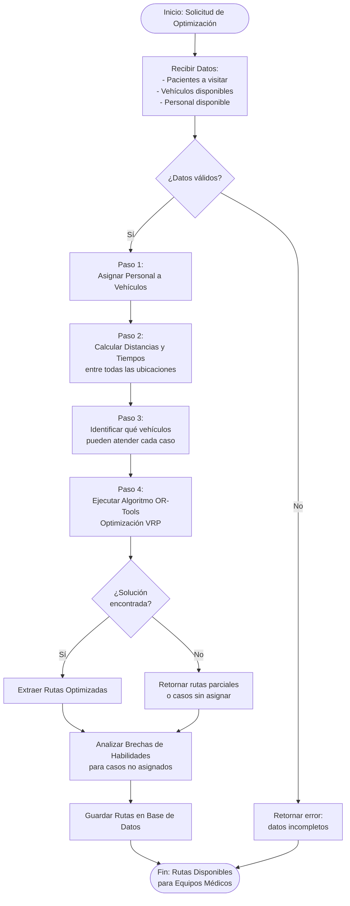

### Paso 1: Preparación de Datos

**¿Qué sucede?**
El sistema recopila toda la información necesaria:

1. **Pacientes a visitar**:
   - Ubicación (dirección/coordenadas)
   - Tipo de atención requerida (ej: "kinesiología respiratoria")
   - Habilidades necesarias (ej: "kinesiólogo + médico")
   - Ventana horaria (ej: "8:00-12:00" o "solo AM")
   - Duración estimada de la visita (ej: 30 minutos)
   - Prioridad (alta, media, baja)

2. **Vehículos disponibles**:
   - Ubicación base (punto de partida - Hospital)
   - Capacidad (número de personas que pueden viajar)
   - Estado (activo/inactivo)

3. **Personal disponible**:
   - Habilidades/especialidades
   - Horario laboral
   - Estado (activo/disponible)

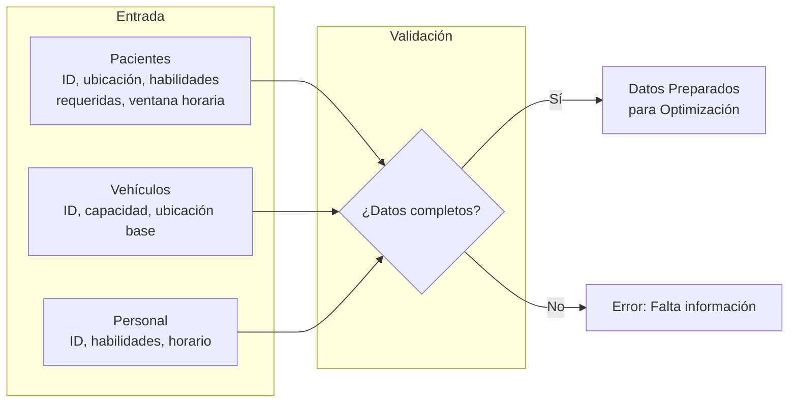

### Paso 2: Asignación de Personal a Vehículos

**¿Qué sucede?**
Antes de calcular rutas, el sistema asigna personal a cada vehículo de manera inteligente.

**Estrategia - Distribución Balanceada**:

1. **Ordenar personal por versatilidad**: Los profesionales con más habilidades se asignan primero
2. **Distribución round-robin**: Se reparten equitativamente entre vehículos
3. **Maximizar cobertura**: Cada vehículo intenta tener la mayor diversidad de habilidades posible

**Ejemplo**:

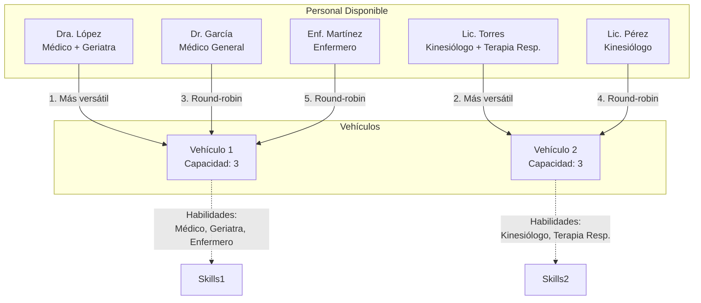

**Resultado**: Cada vehículo tiene un equipo multidisciplinario que puede atender diversos tipos de casos.

### Paso 3: Cálculo de Distancias y Tiempos

**¿Qué sucede?**
El sistema calcula la distancia y tiempo de viaje entre TODAS las ubicaciones posibles.

**Métodos de cálculo** (en orden de preferencia):

1. **Google Maps con tráfico real** : Considera tráfico en tiempo real
2. **Simulación de tráfico**: Aplica multiplicadores según la hora del día
   - 8:00-9:00 AM: +50% de tiempo (hora pico)
   - 12:00-13:00: +20% (hora almuerzo)
   - 17:00-19:00: +40-50% (hora pico tarde)
3. **Distancia en línea recta (Haversine)**: Cálculo geométrico (fallback)

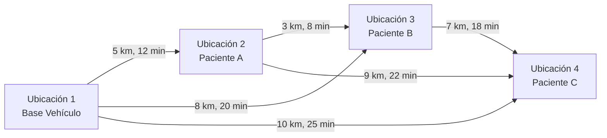

**Resultado**: Una matriz con tiempos/distancias entre todos los puntos.

### Paso 4: Identificación de Vehículos Compatibles

**¿Qué sucede?**
Para cada paciente, el sistema determina qué vehículos PUEDEN atenderlo según las habilidades de su equipo.

**Ejemplo**:

| Paciente | Habilidades Requeridas | Vehículos Compatibles |
|----------|------------------------|----------------------|
| Paciente A | Médico + Kinesiólogo | Vehículo 1 (tiene médico), Vehículo 2 (tiene kinesiólogo) ❌ Ninguno cumple TODO |
| Paciente B | Kinesiólogo | Vehículo 2 ✓ |
| Paciente C | Enfermero | Vehículo 1 ✓ |

**Casos sin vehículos compatibles** se marcan como "no asignables" desde el principio.

### Paso 5: Optimización con OR-Tools (OPen Source creada por Google)

**¿Qué sucede?**
El sistema ejecuta el algoritmo de Google OR-Tools, una herramienta de investigación operativa que resuelve problemas de "ruteo de vehículos".

**¿Qué es OR-Tools?**
- Biblioteca matemática desarrollada por Google
- Experta en resolver problemas de optimización combinatoria
- Usada por empresas de logística, delivery, transporte

**¿Cómo funciona internamente?**

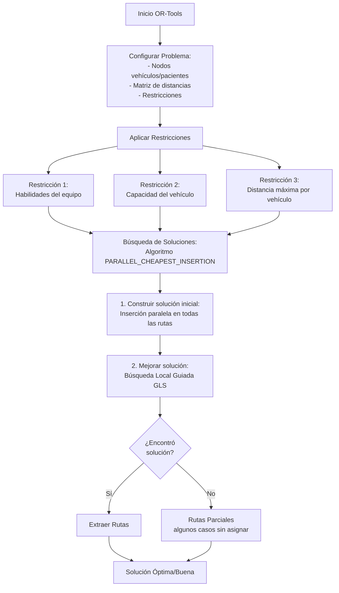

**Estrategia de búsqueda**:

1. **PARALLEL_CHEAPEST_INSERTION**:
   - Construye todas las rutas en paralelo
   - En cada paso, inserta el paciente más "barato" (cercano) en la mejor posición
   - Balancea automáticamente la carga entre vehículos

2. **GUIDED_LOCAL_SEARCH (GLS)**:
   - Mejora la solución inicial mediante cambios locales
   - Intenta intercambiar pacientes entre rutas
   - Reordena visitas dentro de cada ruta
   - Busca reducir distancia total

**Penalizaciones**:

El sistema usa "penalizaciones" para guiar la búsqueda:

- **Alta penalización (100,000)**: Para casos que SÍ pueden asignarse → el algoritmo prefiere incluirlos
- **Penalización cero (0)**: Para casos sin vehículos compatibles → el algoritmo los descarta sin costo

### Paso 6: Extracción de Solución

**¿Qué sucede?**
El sistema traduce la solución matemática en rutas legibles:

Para cada vehículo:
1. Extrae la secuencia de visitas
2. Calcula tiempos de llegada y salida
3. Valida que el equipo tenga las habilidades necesarias
4. Calcula métricas (distancia total, tiempo total)

**Ejemplo de Ruta Generada**:

```
RUTA VEHÍCULO 1 - Dr. García, Enf. Martínez
-----------------------------------------------
08:00 - Salida desde base (Hospital Quilpue)
08:25 - Llegada Paciente A (Av. Libertador 1234)
        Atención: 30 min (Médico General)
08:55 - Salida
09:10 - Llegada Paciente C (Calle 45 #678)
        Atención: 45 min (Enfermería)
09:55 - Salida
10:20 - Regreso a base

Total: 2 visitas, 35 km, 140 minutos
```

### Paso 7: Análisis de Casos No Asignados

**¿Qué sucede?**
Si algunos pacientes no pudieron asignarse, el sistema analiza POR QUÉ y genera recomendaciones.

---

## ¿Cómo Decide el Sistema Cuál Ruta es Mejor?

El sistema evalúa soluciones usando múltiples criterios. No hay una única "mejor ruta", sino un balance entre objetivos:

### Criterios de Evaluación (en orden de importancia)

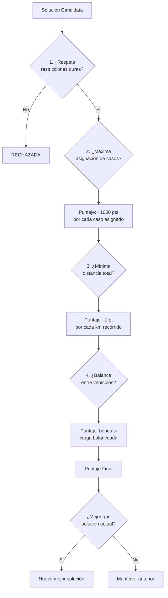

### 1. Restricciones Duras (DEBEN cumplirse)

Estas restricciones son obligatorias. Si una solución las viola, se rechaza automáticamente.

| Restricción | Descripción | Ejemplo |
|-------------|-------------|---------|
| **Habilidades** | Cada caso debe ser atendido por un vehículo cuyo equipo tenga TODAS las habilidades requeridas | Si paciente necesita "Médico + Kinesiólogo", el vehículo debe tener ambos |
| **Capacidad del vehículo** | No se pueden asignar más casos que la capacidad del vehículo | Vehículo capacidad 5 → máximo 5 visitas |
| **Distancia máxima** | Ninguna ruta puede exceder 300 km | Evita rutas imposibles |

### 2. Objetivos de Optimización (balance entre ellos)

Estos son los criterios que el sistema trata de MAXIMIZAR o MINIMIZAR:

#### A) Maximizar Asignación de Casos

**Prioridad**: Alta ⭐⭐⭐

**Objetivo**: Asignar el mayor número de pacientes posible.

**Cómo lo logra**:
- Penaliza fuertemente dejar casos sin asignar (penalización de 100,000)
- El algoritmo prefiere soluciones con más casos asignados

**Ejemplo**:
- Solución A: 12 casos asignados, 50 km total
- Solución B: 10 casos asignados, 40 km total
- **Ganador**: Solución A (más casos asignados > menor distancia)

#### B) Minimizar Distancia Total

**Prioridad**: Media-Alta 

**Objetivo**: Reducir los kilómetros recorridos por todos los vehículos.

**Beneficios**:
- Menor consumo de combustible
- Más tiempo disponible para atención
- Menos desgaste de vehículos

**Cómo lo logra**:
- Usa la distancia como "costo de arco" entre visitas
- El algoritmo busca rutas cortas conectando pacientes cercanos

**Ejemplo**:

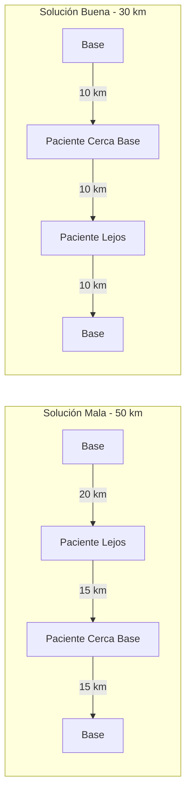

#### C) Minimizar Tiempo Total

**Prioridad**: Media-Alta **

**Objetivo**: Reducir el tiempo total de las rutas (viaje + atención).

**Consideraciones**:
- Incluye tiempo de viaje (con tráfico)
- Incluye tiempo de atención a cada paciente
- Respeta horario laboral (8:00-17:00)

**Cómo lo logra**:
- Usa matriz de tiempos con tráfico real/simulado
- Limita tiempo máximo por ruta a 12 horas (720 minutos)

#### D) Balancear Carga entre Vehículos

**Prioridad**: Media *

**Objetivo**: Distribuir equitativamente las visitas entre vehículos.

**Beneficios**:
- Evita sobrecargar un vehículo mientras otros están ociosos
- Distribuye el trabajo justo entre equipos

**Ejemplo**:

| Solución | Vehículo 1 | Vehículo 2 | Vehículo 3 | Balance |
|----------|------------|------------|------------|---------|
| Mala | 8 visitas | 2 visitas | 2 visitas | ❌ Desbalanceado |
| Buena | 4 visitas | 4 visitas | 4 visitas | ✅ Balanceado |

### Función de Costo (Fórmula Simplificada)

El sistema asigna un "puntaje" a cada solución:

```
Puntaje Total =
    (Casos Asignados × 100,000)          # Maximizar asignación
    - (Distancia Total en metros)        # Minimizar distancia
    - (Casos No Asignados × 100,000)     # Penalizar casos sin asignar
```

**La solución con mayor puntaje gana.**

### Ejemplo Comparativo

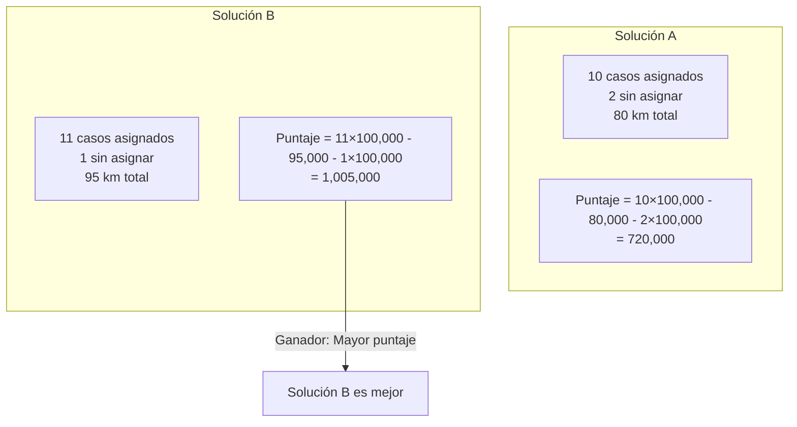

**Resultado**: Aunque la Solución B tiene 15 km más de distancia, asigna un caso adicional, lo cual es más valioso para el sistema.

---

## Restricciones que el Sistema Respeta

### 1. Habilidades del Personal

**Regla**: Un caso solo puede asignarse a un vehículo cuyo equipo tenga TODAS las habilidades requeridas.

**Ejemplo**:

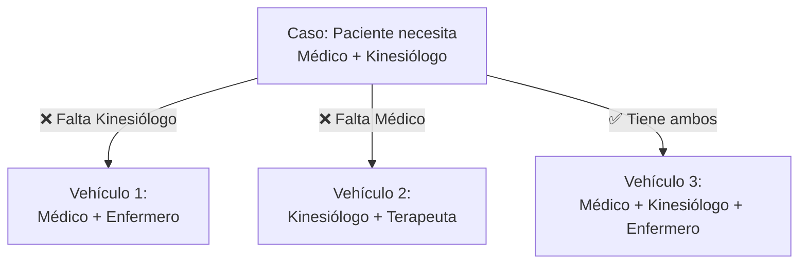

**Si ningún vehículo tiene las habilidades**: El caso se marca como "no asignable" y se reporta en el análisis de brechas.

### 2. Capacidad del Vehículo

**Regla**: No se pueden asignar más visitas que la capacidad del vehículo.

**Ejemplo**:
- Vehículo con capacidad 5 → máximo 5 visitas en su ruta

**Nota**: La capacidad actual se ajusta dinámicamente para asegurar factibilidad. El sistema puede aumentar capacidades si es necesario para asignar todos los casos.

### 3. Ventanas de Tiempo (Suavizadas)

**Regla**: Se intenta respetar las preferencias horarias de los pacientes, pero con flexibilidad.

**Tipos de ventanas de tiempo**:

| Tipo | Descripción | Ejemplo |
|------|-------------|---------|
| **Específica** | Rango horario exacto | "10:00-12:00" |
| **General AM** | Mañana | "08:00-12:00" |
| **General PM** | Tarde | "12:00-17:00" |
| **Sin restricción** | Todo el día laboral | "08:00-17:00" |

**Implementación actual**: Las ventanas de tiempo están DESACTIVADAS en el código para permitir mayor flexibilidad y asegurar que se encuentren soluciones. El sistema prioriza asignar todos los casos sobre cumplir horarios exactos.

**Razón**: En la práctica, es preferible visitar a un paciente fuera de su ventana preferida que no visitarlo en absoluto.

### 4. Horario Laboral

**Regla**: Todas las rutas deben completarse dentro del horario laboral.

**Horario predeterminado**: 8:00 AM - 5:00 PM

**Duración máxima por ruta**: 12 horas (720 minutos)

### 5. Distancia Máxima por Vehículo

**Regla**: Ninguna ruta puede exceder 300 km.

**Razón**: Límite de seguridad y factibilidad operativa.

---

## Análisis de Brechas de Habilidades

Cuando algunos pacientes no pueden asignarse, el sistema genera un **análisis de brechas** que identifica QUÉ habilidades faltan y CUÁNTO impacto tendría contratar personal adicional.

### Componentes del Análisis

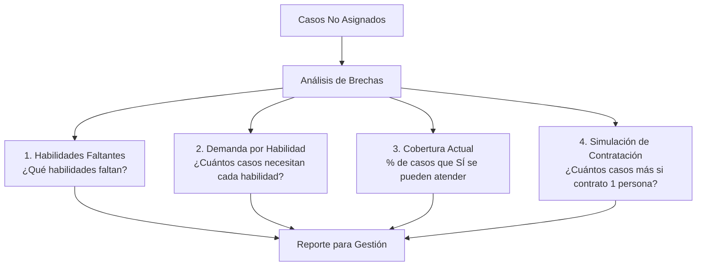

### Ejemplo de Reporte de Brechas

```
📊 ANÁLISIS DE BRECHAS DE HABILIDADES
========================================

Tasa de Asignación: 75% (9 de 12 casos asignados)
Casos no asignados: 3

 HABILIDADES MÁS DEMANDADAS (Prioridad de Contratación):

1. Terapeuta Ocupacional
   - 2 casos bloqueados
   - Cobertura actual: 0%
   - Impacto de contratación: +2 casos asignables

2. Fonoaudiólogo
   - 1 caso bloqueado
   - Cobertura actual: 0%
   - Impacto de contratación: +1 caso asignable

📋 DETALLE DE CASOS NO ASIGNADOS:

Caso #105 - Paciente: María González
  - Habilidades requeridas: Médico, Terapeuta Ocupacional
  - Habilidades faltantes: Terapeuta Ocupacional
  - Prioridad: Alta

Caso #107 - Paciente: Juan Pérez
  - Habilidades requeridas: Fonoaudiólogo
  - Habilidades faltantes: Fonoaudiólogo
  - Prioridad: Media

Caso #109 - Paciente: Ana Martínez
  - Habilidades requeridas: Médico, Terapeuta Ocupacional
  - Habilidades faltantes: Terapeuta Ocupacional
  - Prioridad: Alta

💡 RECOMENDACIÓN:
Contratar 1 Terapeuta Ocupacional permitiría asignar 2 casos adicionales (67% de mejora).
```

### Métricas del Análisis

| Métrica | Descripción | Uso |
|---------|-------------|-----|
| **Tasa de Asignación** | % de casos asignados vs solicitados | KPI principal de cobertura |
| **Casos por Habilidad** | Número de casos que requieren cada habilidad | Identificar cuellos de botella |
| **Cobertura por Habilidad** | % de casos que pueden atenderse con habilidad X | Evaluar suficiencia de personal |
| **Impacto de Contratación** | Casos adicionales si se contrata 1 persona con habilidad X | Priorizar contrataciones |

---

## Casos Especiales y Limitaciones

### 1. Pacientes sin Vehículos Compatibles

**Situación**: Un paciente requiere habilidades que ningún vehículo tiene.

**Acción del sistema**:
1. Pre-filtra el caso (no intenta asignarlo)
2. Lo marca como "infeasible" desde el principio
3. Lo incluye en el análisis de brechas
4. Genera recomendación de contratación

**Ejemplo**:
- Paciente necesita "Nutricionista + Psicólogo"
- Ningún vehículo tiene ambas habilidades
- Sistema reporta: "Contratar Nutricionista permitiría asignar este caso"

### 2. Todos los Vehículos a Capacidad Máxima

**Situación**: Más casos que capacidad total de vehículos.

**Acción del sistema**:
1. Prioriza casos por importancia (casos de alta prioridad primero)
2. Asigna hasta llenar todas las rutas
3. Reporta casos sin capacidad disponible
4. Sugiere: "Agregar 1 vehículo adicional permitiría asignar X casos más"

### 3. Casos Muy Distantes

**Situación**: Un paciente está muy lejos (>100 km de otros).

**Acción del sistema**:
- Puede crear una ruta con un solo caso si es factible
- O dejarlo sin asignar si excede distancia máxima (300 km)
- Reporta en métricas como "caso geográficamente aislado"

### 4. Tiempo Insuficiente

**Situación**: Demasiados casos para completar en un día laboral.

**Acción del sistema**:
- Asigna el máximo que cabe en horario laboral (8:00-17:00)
- Reporta casos sin tiempo disponible
- Sugiere distribuir en múltiples días

### 5. Sin Solución Óptima en Tiempo Límite

**Situación**: OR-Tools no encuentra la solución óptima en 60 segundos.

**Acción del sistema**:
- Retorna la mejor solución encontrada hasta el momento
- Marca como "parcialmente óptima"
- Aún así es una solución válida y buena

---

## Ejemplos Prácticos

### Ejemplo 1: Día Típico con 12 Casos

**Entrada**:
- 12 pacientes distribuidos en la ciudad
- 3 vehículos disponibles
- 9 profesionales (3 médicos, 3 kinesiólogos, 2 enfermeros, 1 geriatra)

**Proceso**:

1. **Asignación de personal a vehículos**:
   - Vehículo 1: Médico + Kinesiólogo + Enfermero
   - Vehículo 2: Médico + Kinesiólogo + Enfermero
   - Vehículo 3: Médico + Kinesiólogo + Geriatra

2. **Cálculo de distancias**: Matriz 12x12 con tiempos considerando tráfico

3. **Optimización**: OR-Tools encuentra solución en 15 segundos

**Salida**:

```
RESULTADO DE OPTIMIZACIÓN
==========================
✅ Éxito: 12 de 12 casos asignados (100%)

Ruta Vehículo 1: 4 visitas, 42 km, 6.5 horas
  08:00 - Salida
  08:30 - Paciente A (Médico)
  09:15 - Paciente D (Kinesiólogo)
  10:45 - Paciente G (Médico + Enfermero)
  12:30 - Paciente J (Kinesiólogo)
  14:30 - Regreso base

Ruta Vehículo 2: 4 visitas, 38 km, 6 horas
  08:00 - Salida
  08:20 - Paciente B (Kinesiólogo)
  09:30 - Paciente E (Médico)
  11:00 - Paciente H (Enfermero)
  13:00 - Paciente K (Médico + Kinesiólogo)
  14:00 - Regreso base

Ruta Vehículo 3: 4 visitas, 45 km, 7 horas
  08:00 - Salida
  08:45 - Paciente C (Médico + Geriatra)
  10:00 - Paciente F (Geriatra)
  11:30 - Paciente I (Médico)
  13:30 - Paciente L (Médico)
  15:00 - Regreso base

TOTALES:
- Distancia total: 125 km
- Tiempo total: 19.5 horas (suma de todas las rutas)
- Casos asignados: 12 / 12 (100%)
- Tiempo de optimización: 15 segundos
```

### Ejemplo 2: Día con Brechas de Habilidades

**Entrada**:
- 10 pacientes
- 2 vehículos
- 6 profesionales (2 médicos, 2 kinesiólogos, 2 enfermeros)
- **Problema**: 3 pacientes requieren "Terapeuta Ocupacional" (no disponible)

**Salida**:

```
RESULTADO DE OPTIMIZACIÓN
==========================
⚠️ Parcial: 7 de 10 casos asignados (70%)

Ruta Vehículo 1: 4 visitas, 35 km
Ruta Vehículo 2: 3 visitas, 28 km

CASOS NO ASIGNADOS: 3

📊 ANÁLISIS DE BRECHAS:
Habilidad faltante: Terapeuta Ocupacional
- 3 casos bloqueados
- Impacto de contratación: +3 casos (100% de mejora)

💡 RECOMENDACIÓN:
Contratar 1 Terapeuta Ocupacional permitiría alcanzar 100% de asignación.
```

### Ejemplo 3: Optimización con Tráfico

**Entrada**:
- Optimización solicitada para mañana a las 8:00 AM (hora pico)
- Google Maps API disponible

**Diferencia**:

| Ruta | Sin Tráfico | Con Tráfico (8 AM) | Diferencia |
|------|-------------|-------------------|------------|
| Base → Paciente A | 15 min | 23 min | +53% |
| Paciente A → B | 10 min | 14 min | +40% |
| Paciente B → C | 8 min | 12 min | +50% |

**Impacto**: El sistema ajusta las rutas para evitar zonas con alto tráfico en hora pico, resultando en rutas más largas en distancia pero más cortas en tiempo real.

---

## Preguntas Frecuentes

### ¿Por qué algunos pacientes no se asignan aunque haya vehículos disponibles?

**Razones posibles**:
1. **Falta de habilidades**: Ningún vehículo tiene el equipo con todas las habilidades necesarias
2. **Capacidad completa**: Todos los vehículos ya están a su capacidad máxima
3. **Ubicación muy distante**: El paciente está a más de 300 km
4. **Tiempo insuficiente**: No hay tiempo en horario laboral para completar la visita

### ¿El sistema siempre encuentra la solución óptima?

**No necesariamente**. El sistema busca una **muy buena solución** en tiempo razonable (menos de 60 segundos).

- En problemas pequeños (≤20 casos): Generalmente encuentra la solución óptima
- En problemas grandes (>50 casos): Encuentra una solución muy buena, cercana al óptimo

**Garantía**: La solución siempre es válida y respeta todas las restricciones.

### ¿Puedo ajustar las prioridades del sistema?

**Actualmente no** desde la interfaz, pero el sistema ya tiene prioridades configuradas:

1. Asignar máximo número de casos
2. Minimizar distancia
3. Balancear carga

Si se requieren prioridades diferentes (ej: priorizar casos urgentes), esto debe configurarse en el código.

### ¿Qué pasa si cambia la disponibilidad de un profesional después de optimizar?

El sistema permite **re-optimizar** en cualquier momento:

1. Se actualizan los profesionales disponibles
2. Se ejecuta nueva optimización
3. Se generan nuevas rutas

**Nota**: Los casos ya "assigned" (asignados) pueden incluirse en re-optimización. El sistema puede reasignarlos a diferentes vehículos si es más eficiente.

### ¿El sistema considera el tráfico en tiempo real?

**Sí, si está configurado Google Maps API**:
- Calcula tiempos con tráfico real
- Ajusta rutas según condiciones de tráfico

**Sin Google Maps API**:
- Usa simulación de tráfico basada en hora del día
- Multiplica tiempos según patrones típicos (hora pico +50%, normal +10%)

---

## Glosario

| Término | Definición |
|---------|-----------|
| **Caso** | Solicitud de visita a un paciente (también llamado "visit request") |
| **Ruta** | Secuencia de visitas asignadas a un vehículo para un día |
| **Habilidad** | Especialidad médica requerida (médico, kinesiólogo, enfermero, etc.) |
| **Vehículo** | Unidad móvil con capacidad para transportar equipo médico |
| **Ventana de tiempo** | Rango horario preferido para la visita (ej: "AM", "10:00-12:00") |
| **Optimización** | Proceso de calcular las mejores rutas posibles |
| **OR-Tools** | Biblioteca matemática de Google para problemas de optimización |
| **VRP** | Vehicle Routing Problem (Problema de Ruteo de Vehículos) |
| **Restricción dura** | Condición que DEBE cumplirse (ej: habilidades) |
| **Restricción suave** | Condición deseable pero no obligatoria (ej: ventana de tiempo) |
| **Brecha de habilidades** | Falta de profesionales con ciertas especialidades |
| **Tasa de asignación** | Porcentaje de casos que se lograron asignar |
| **Penalización** | Costo artificial para guiar el algoritmo a evitar/preferir ciertas acciones |
| **Heurística** | Método aproximado de resolución (más rápido, menos preciso) |
| **Factibilidad** | Capacidad de una solución de cumplir todas las restricciones |

---

## Diagrama Completo del Sistema

```mermaid
flowchart TD
    Start([Usuario solicita optimización]) --> Input[Entrada de Datos:<br/>- Casos a visitar<br/>- Vehículos disponibles<br/>- Personal disponible]

    Input --> Prep[PREPARACIÓN]

    Prep --> P1[1. Validar datos]
    P1 --> P2[2. Asignar personal a vehículos<br/>Distribución balanceada round-robin]
    P2 --> P3[3. Calcular matriz distancias/tiempos<br/>Google Maps con tráfico o simulación]
    P3 --> P4[4. Identificar vehículos compatibles<br/>por habilidades para cada caso]

    P4 --> Opt[OPTIMIZACIÓN OR-TOOLS]

    Opt --> O1[1. Configurar problema VRP<br/>Nodos, restricciones, costos]
    O1 --> O2[2. Aplicar restricciones:<br/>- Habilidades via SetAllowedVehicles<br/>- Capacidad<br/>- Distancia máxima]
    O2 --> O3[3. Búsqueda de solución:<br/>PARALLEL_CHEAPEST_INSERTION<br/>+ GUIDED_LOCAL_SEARCH]

    O3 --> Check{¿Solución<br/>encontrada?}

    Check -->|Sí| Extract[EXTRACCIÓN]
    Check -->|No| Partial[Solución parcial<br/>o vacía]

    Extract --> E1[1. Extraer rutas por vehículo]
    E1 --> E2[2. Calcular tiempos llegada/salida]
    E2 --> E3[3. Validar habilidades]
    E3 --> E4[4. Calcular métricas totales]

    Partial --> E4

    E4 --> Analysis[ANÁLISIS DE BRECHAS]

    Analysis --> A1[1. Identificar casos no asignados]
    A1 --> A2[2. Detectar habilidades faltantes]
    A2 --> A3[3. Calcular demanda por habilidad]
    A3 --> A4[4. Simular impacto de contratación]
    A4 --> A5[5. Generar recomendaciones]

    A5 --> Save[Guardar rutas en BD]

    Save --> Output[SALIDA:<br/>- Rutas optimizadas<br/>- Métricas<br/>- Análisis de brechas<br/>- Recomendaciones]

    Output --> End([Usuario visualiza rutas<br/>en panel admin])
```

---

## Conclusión

El Sistema de Optimización de Rutas SOR-HD es una herramienta poderosa que:

✅ **Automatiza** la planificación de rutas, ahorrando horas de trabajo manual
✅ **Optimiza** las visitas para maximizar cobertura y minimizar distancias
✅ **Respeta** restricciones de habilidades, capacidad y horarios
✅ **Analiza** brechas de personal y genera recomendaciones accionables
✅ **Adapta** rutas considerando tráfico en tiempo real

**Beneficios principales**:
- Mayor número de pacientes atendidos por día
- Menos tiempo de viaje, más tiempo de atención
- Distribución equitativa de carga entre equipos
- Decisiones informadas sobre contratación de personal
- Operación más eficiente del servicio de hospitalización domiciliaria

---

**Versión del documento**: 1.0
**Última actualización**: Noviembre 2025
**Contacto**: Equipo de Desarrollo SOR-HD
